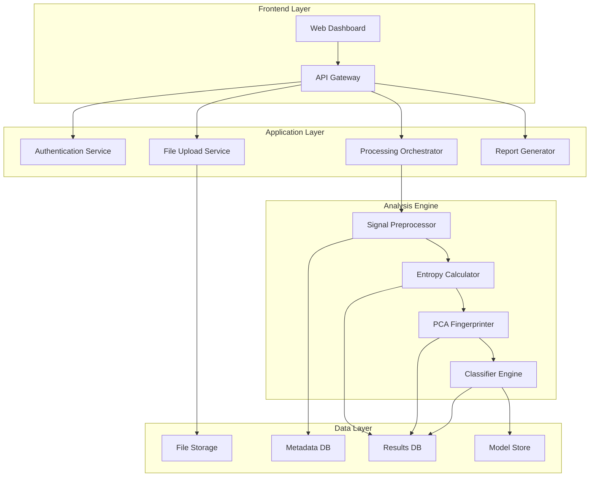

# Design Document

## Overview

The CTEntropy Diagnostic Platform is a microservices-based system that transforms symbolic entropy research into a production-ready clinical diagnostic tool. The platform processes real EEG/MRI data through advanced signal processing pipelines, applies multiple entropy analysis methods, generates PCA-based neuro-fingerprints, and provides clinical-grade diagnostic reports through an intuitive web interface.

The system architecture prioritizes scalability, clinical compliance, and research reproducibility while maintaining the core symbolic entropy methodology proven in the CTEntropy research.

## Architecture

### High-Level System Architecture



### Technology Stack

**Frontend:**
- React.js with TypeScript for the web dashboard
- D3.js for interactive visualizations
- Material-UI for clinical-grade interface components
- WebSocket connections for real-time progress updates

**Backend Services:**
- Python FastAPI for REST APIs and async processing
- Celery with Redis for distributed task processing
- PostgreSQL for metadata and results storage
- MinIO/S3 for file storage
- Docker containers with Kubernetes orchestration

**Analysis Engine:**
- NumPy/SciPy for core signal processing
- MNE-Python for EEG/MEG data handling
- NiBabel for MRI/DICOM processing
- Scikit-learn for PCA and classification
- Custom CTEntropy modules for symbolic entropy calculation

## Components and Interfaces

### 1. File Upload Service

**Purpose:** Handle secure upload and validation of neurological data files

**Key Features:**
- Multi-format support (EDF, BDF, SET, FIF for EEG; DICOM, NIfTI for MRI)
- Chunked upload for large files with resume capability
- File integrity validation and format compliance checking
- Metadata extraction and storage

**API Interface:**
```python
POST /api/v1/upload
- Multipart file upload with metadata
- Returns: upload_id, file_info, validation_status

GET /api/v1/upload/{upload_id}/status
- Returns: progress, validation_results, errors

POST /api/v1/upload/{upload_id}/validate
- Triggers detailed file validation
- Returns: channel_info, sampling_rate, duration, quality_metrics
```

### 2. Signal Preprocessor

**Purpose:** Clean and prepare raw neurological signals for entropy analysis

**Core Algorithms:**
- Adaptive filtering (Butterworth, Chebyshev, elliptic filters)
- Artifact detection using Independent Component Analysis (ICA)
- Automated bad channel detection and interpolation
- Configurable windowing with overlap management

**Processing Pipeline:**
```python
class SignalPreprocessor:
    def __init__(self, config: PreprocessingConfig):
        self.filters = FilterBank(config.filter_params)
        self.artifact_detector = ICADetector(config.ica_params)
        self.windower = SlidingWindow(config.window_params)
    
    def process(self, raw_data: RawData) -> ProcessedSignal:
        # 1. Apply filtering
        filtered = self.filters.apply(raw_data)
        # 2. Detect and remove artifacts
        cleaned = self.artifact_detector.clean(filtered)
        # 3. Segment into analysis windows
        windowed = self.windower.segment(cleaned)
        return ProcessedSignal(windowed, metadata)
```

### 3. Enhanced Entropy Calculator

**Purpose:** Implement multiple entropy calculation methods with optimized performance

**Entropy Methods:**
- **Symbolic Entropy:** FFT-based spectral entropy (from original CTEntropy)
- **Fractal Entropy:** Box-counting and correlation dimension analysis
- **Hierarchical Complexity Measures:** Multi-scale entropy analysis
- **Sample Entropy:** Template matching-based complexity
- **Permutation Entropy:** Ordinal pattern analysis

**Implementation:**
```python
class EntropyEngine:
    def __init__(self):
        self.calculators = {
            'symbolic': SymbolicEntropyCalculator(),
            'fractal': FractalEntropyCalculator(),
            'hierarchical': HierarchicalComplexityCalculator(),
            'sample': SampleEntropyCalculator(),
            'permutation': PermutationEntropyCalculator()
        }
    
    def calculate_all(self, signal: ProcessedSignal) -> EntropyResults:
        results = {}
        for method, calculator in self.calculators.items():
            results[method] = calculator.compute(signal)
        return EntropyResults(results)
```

### 4. PCA Fingerprinter

**Purpose:** Generate multi-dimensional neuro-fingerprints for pattern recognition

**Features:**
- Multi-entropy PCA analysis combining all entropy methods
- Dimensionality reduction with explained variance tracking
- Cluster analysis for condition identification
- Interactive visualization generation

**Core Algorithm:**
```python
class PCAFingerprinter:
    def __init__(self, n_components: int = 10):
        self.pca = PCA(n_components=n_components)
        self.scaler = StandardScaler()
        
    def generate_fingerprint(self, entropy_results: EntropyResults) -> NeuroFingerprint:
        # Combine all entropy measures into feature matrix
        feature_matrix = self._combine_entropy_features(entropy_results)
        # Normalize features
        scaled_features = self.scaler.fit_transform(feature_matrix)
        # Apply PCA
        pca_components = self.pca.fit_transform(scaled_features)
        
        return NeuroFingerprint(
            components=pca_components,
            explained_variance=self.pca.explained_variance_ratio_,
            feature_importance=self._calculate_feature_importance()
        )
```

### 5. Classifier Engine

**Purpose:** Provide automated diagnostic classification with confidence scoring

**Classification Models:**
- Support Vector Machine (SVM) for high-dimensional data
- Random Forest for feature importance analysis
- Neural Network for complex pattern recognition
- Ensemble methods combining multiple approaches

**Training Pipeline:**
```python
class ClassifierEngine:
    def __init__(self):
        self.models = {
            'svm': SVMClassifier(),
            'rf': RandomForestClassifier(),
            'nn': NeuralNetworkClassifier(),
            'ensemble': EnsembleClassifier()
        }
        self.conditions = ['healthy', 'cte', 'alzheimers', 'depression']
    
    def predict(self, fingerprint: NeuroFingerprint) -> DiagnosticResult:
        predictions = {}
        confidences = {}
        
        for model_name, model in self.models.items():
            pred = model.predict_proba(fingerprint.components)
            predictions[model_name] = pred
            confidences[model_name] = model.decision_function(fingerprint.components)
        
        # Ensemble prediction
        final_prediction = self._ensemble_predict(predictions)
        confidence_score = self._calculate_confidence(confidences)
        
        return DiagnosticResult(
            predicted_condition=final_prediction,
            confidence_score=confidence_score,
            differential_diagnosis=self._rank_conditions(predictions),
            feature_importance=self._get_feature_importance()
        )
```

### 6. Report Generator

**Purpose:** Create clinical-grade diagnostic reports with visualizations

**Report Components:**
- Executive summary with key findings
- Entropy trend analysis with time-series plots
- PCA visualization with condition clustering
- Risk assessment with confidence intervals
- Methodology explanation for clinical interpretation

**Report Templates:**
```python
class ReportGenerator:
    def __init__(self):
        self.pdf_engine = PDFGenerator()
        self.viz_engine = VisualizationEngine()
        
    def generate_clinical_report(self, analysis_results: AnalysisResults) -> ClinicalReport:
        report = ClinicalReport()
        
        # Executive Summary
        report.add_section(self._generate_executive_summary(analysis_results))
        
        # Entropy Analysis
        entropy_plots = self.viz_engine.create_entropy_plots(analysis_results.entropy)
        report.add_section("Entropy Analysis", entropy_plots)
        
        # PCA Fingerprint
        pca_plots = self.viz_engine.create_pca_plots(analysis_results.fingerprint)
        report.add_section("Neuro-Fingerprint Analysis", pca_plots)
        
        # Diagnostic Results
        diagnostic_viz = self.viz_engine.create_diagnostic_plots(analysis_results.diagnosis)
        report.add_section("Diagnostic Assessment", diagnostic_viz)
        
        return report
```

## Data Models

### Core Data Structures

```python
@dataclass
class PatientData:
    patient_id: str
    age: int
    gender: str
    medical_history: List[str]
    upload_timestamp: datetime
    file_paths: List[str]
    metadata: Dict[str, Any]

@dataclass
class ProcessedSignal:
    signal_data: np.ndarray
    sampling_rate: float
    channels: List[str]
    preprocessing_config: PreprocessingConfig
    quality_metrics: QualityMetrics

@dataclass
class EntropyResults:
    symbolic_entropy: np.ndarray
    fractal_entropy: np.ndarray
    hierarchical_complexity: np.ndarray
    sample_entropy: np.ndarray
    permutation_entropy: np.ndarray
    time_windows: np.ndarray
    calculation_params: Dict[str, Any]

@dataclass
class NeuroFingerprint:
    components: np.ndarray
    explained_variance: np.ndarray
    feature_importance: Dict[str, float]
    cluster_assignment: int
    distance_to_centroids: Dict[str, float]

@dataclass
class DiagnosticResult:
    predicted_condition: str
    confidence_score: float
    differential_diagnosis: List[Tuple[str, float]]
    risk_factors: List[str]
    recommendations: List[str]
    timestamp: datetime
```

### Database Schema

**PostgreSQL Tables:**
```sql
-- Patients table
CREATE TABLE patients (
    id UUID PRIMARY KEY,
    patient_id VARCHAR(50) UNIQUE NOT NULL,
    age INTEGER,
    gender VARCHAR(10),
    medical_history JSONB,
    created_at TIMESTAMP DEFAULT NOW()
);

-- Analysis sessions
CREATE TABLE analysis_sessions (
    id UUID PRIMARY KEY,
    patient_id UUID REFERENCES patients(id),
    session_name VARCHAR(100),
    status VARCHAR(20),
    config JSONB,
    created_at TIMESTAMP DEFAULT NOW(),
    completed_at TIMESTAMP
);

-- Results storage
CREATE TABLE analysis_results (
    id UUID PRIMARY KEY,
    session_id UUID REFERENCES analysis_sessions(id),
    entropy_data JSONB,
    pca_data JSONB,
    diagnostic_result JSONB,
    report_path VARCHAR(255),
    created_at TIMESTAMP DEFAULT NOW()
);
```

## Error Handling

### Error Categories and Responses

**File Processing Errors:**
- Invalid file format → Clear format requirements and conversion suggestions
- Corrupted data → Data integrity check results and recovery options
- Insufficient data quality → Quality metrics and preprocessing recommendations

**Analysis Errors:**
- Numerical instability → Fallback algorithms and parameter adjustment
- Memory limitations → Chunked processing and resource optimization
- Model prediction failures → Confidence thresholds and manual review flags

**System Errors:**
- Service unavailability → Graceful degradation and retry mechanisms
- Database connectivity → Cached results and offline mode
- Storage limitations → Cleanup procedures and capacity monitoring

### Error Recovery Strategies

```python
class ErrorHandler:
    def __init__(self):
        self.retry_strategies = {
            'transient': ExponentialBackoffRetry(max_attempts=3),
            'resource': ResourceOptimizationRetry(),
            'data': DataValidationRetry()
        }
    
    def handle_analysis_error(self, error: AnalysisError, context: AnalysisContext):
        if error.category == 'numerical_instability':
            return self._apply_fallback_algorithm(context)
        elif error.category == 'insufficient_data':
            return self._suggest_preprocessing_improvements(context)
        elif error.category == 'memory_limit':
            return self._enable_chunked_processing(context)
        else:
            return self._escalate_to_manual_review(error, context)
```

## Testing Strategy

### Unit Testing
- Individual entropy calculation methods with known signal patterns
- PCA fingerprinting with synthetic data
- Classification accuracy with labeled datasets
- Report generation with mock analysis results

### Integration Testing
- End-to-end processing pipeline with real EEG/MRI data
- API endpoint testing with various file formats
- Database operations and data consistency
- Error handling and recovery mechanisms

### Performance Testing
- Large file processing benchmarks
- Concurrent user load testing
- Memory usage optimization
- Processing time scalability

### Clinical Validation Testing
- Accuracy validation with known diagnostic cases
- Inter-rater reliability with clinical experts
- Sensitivity and specificity analysis
- Cross-validation with multiple datasets

### Testing Framework
```python
class CTEntropyTestSuite:
    def __init__(self):
        self.test_data = TestDataGenerator()
        self.validators = ValidationSuite()
    
    def test_entropy_accuracy(self):
        # Test with known entropy patterns
        known_signals = self.test_data.generate_known_patterns()
        for signal, expected_entropy in known_signals:
            calculated = self.entropy_engine.calculate(signal)
            assert abs(calculated - expected_entropy) < 0.01
    
    def test_classification_performance(self):
        # Test with labeled clinical data
        test_set = self.test_data.load_clinical_test_set()
        predictions = self.classifier.predict_batch(test_set.features)
        accuracy = self.validators.calculate_accuracy(predictions, test_set.labels)
        assert accuracy > 0.85  # Minimum clinical threshold
```

This design provides a robust, scalable foundation for transforming your CTEntropy research into a production diagnostic platform while maintaining scientific rigor and clinical compliance.